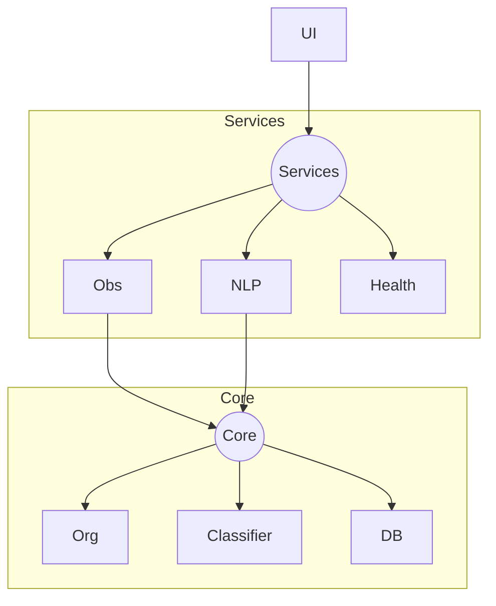

# FileManager Pro

**FileManager Pro** is a production-grade Python application designed for automated file organization, intelligent directory monitoring, and natural language control. It combines a robust background engine with a modern `customtkinter` interface.


---

## 🚀 Features

- **Real-time Monitoring**: Instantaneously detects and sorts files using `watchdog`.
- **Intelligent Assistant**: Natural language chatbot ("Find my PDFs", "Cleanup downloads") powered by `spaCy` and `SQLite`.
- **Auto-Startup**: "Run on Windows Startup" integration for set-and-forget operation.
- **Safety First**: "Dry-Run" mode prevents accidental file deletion during cleanup.
- **Smart Cleanup**: Identifies duplicates (SHA-256), orphans, and zero-byte files.
- **Modern UI**: Dark-mode dashboard with real-time logs and maintenance reports.

---

## 🛠️ Architecture

The project follows a modular Service-Oriented Architecture (SOA):



- **`src/services/`**: Singleton managers (Config, Logger, Observer).
- **`src/core/`**: Pure logic (File operations, Hashing, NLP parsing).
- **`src/gui/`**: View components decoupled from business logic.

---

## 🏁 Getting Started

### Option 1: Running from Source
1. **Clone the repository**:
   ```bash
   git clone https://github.com/yourusername/filemanager-pro.git
   cd filemanager-pro
   ```
2. **Install dependencies**:
   ```bash
   pip install -r requirements.txt
   python -m spacy download en_core_web_sm
   ```
3. **Run the application**:
   ```bash
   python -m src.main
   ```

### Option 2: Building Executable
To create a standalone `.exe`:
1. Run the build script:
   ```bash
   build_exe.bat
   ```
2. Find your executable in the `dist/` folder.

---

## 🧩 Challenges & Solutions

Developing a filesystem manager for Windows introduced several unique engineering challenges:

### 1. The "File In Use" Race Condition
**Problem**: When a browser downloads a generic file (e.g., `.crdownload`), our observer would try to move it immediately, crashing because the file was locked.  
**Solution**: Implemented a `FileLock` retry mechanism in `observer.py`. The system now waits for the file handle to be released before attempting a move.

### 2. Dependency Hell in Executables
**Problem**: `PyInstaller` failed to bundle the `en_core_web_sm` spaCy model and hidden imports like `babel`.  
**Solution**: Custom `hook-spacy.py` and hidden-import definitions in `FileManager Pro.spec` to explicitly include language model vectors.

### 3. Infinite Recursion Loops
**Problem**: Moving a file triggered a "File Modified" event, which triggered another move, creating an infinite loop.  
**Solution**: The `ObserverService` now essentially ignores events originating from its own destination folders and uses a brief cooldown.

### 4. Config Corruption
**Problem**: The "Run Cleanup" command accidentally overwrote the entire `config.json` with a partial dictionary, wiping out user settings.  
**Solution**: Implemented a strict `validate_and_merge` strategy in `config_service.py` and fixed the specific NLP handler to perform a specific key update rather than a full overwrite.

---

## 🤝 Contributing
1. Fork the repo.
2. Create feature branch (`git checkout -b feature/amazing-feature`).
3. Commit changes (`git commit -m 'Add amazing feature'`).
4. Push to branch (`git push origin feature/amazing-feature`).
5. Open a Pull Request.
